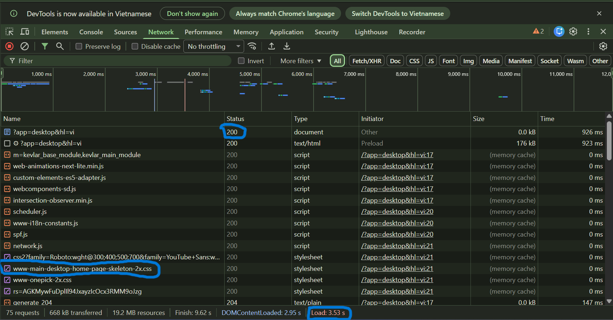

# 📋 PHẦN A - KIỂM TRA ĐỌC HIỂU

## Câu A1 - HTTPS & Browser

**Nguồn tham chiếu:**

* `01_introduction_html_universe.md` — Mục `1.2. HTTP — Ngôn ngữ để Client và Server hiểu nhau`
* `01_introduction_html_universe.md` — Mục `1.3. Browser Rendering — Từ Code thành Hình ảnh`

### a. Khi gõ `https://shopee.vn` vào trình duyệt và nhấn Enter, có 8 bước chính xảy ra (từ DNS lookup đến render):

1. Trình duyệt nhận URL `https://shopee.vn`, tách giao thức HTTPS và tên miền `shopee.vn`, sau đó kiểm tra DNS cache đã lưu trước đó hay chưa.
2. Nếu chưa có cache, trình duyệt thực hiện **DNS Lookup** để tìm địa chỉ IP tương ứng với tên miền `shopee.vn`.
3. Sau khi có IP, trình duyệt thiết lập kết nối **TCP** tới máy chủ qua cổng **443**.
4. Trình duyệt và máy chủ thực hiện **TLS Handshake** để tạo kết nối HTTPS an toàn.
5. Khi kết nối thành công, trình duyệt gửi **HTTP Request** (thường là GET).
6. Server nhận request, xử lý và trả về **HTTP Response** gồm HTML, CSS, JavaScript, hình ảnh...
7. Trình duyệt phân tích HTML tạo **DOM**, phân tích CSS tạo **CSSOM**, tải thêm các tài nguyên liên quan.
8. Trình duyệt tạo **Render Tree**, thực hiện **Layout**, **Paint** rồi hiển thị giao diện cho người dùng.

### b. Tab Network trong Chrome DevTools cho biết:

* Danh sách request gửi đi
* Status Code của từng request
* Loại tài nguyên (HTML, CSS, JS, Img...)
* Dung lượng file
* Thời gian tải từng request
* Tổng thời gian load trang
* Waterfall timeline thể hiện tiến trình tải



---

## Câu A2 - Semantic HTML

**Nguồn tham chiếu:**

* `04_visible_part_html.md` — Mục `Semantic HTML5 — "Thẻ có ý nghĩa"` và `Bản đồ Semantic Elements`
* `01_introduction_html_universe.md` — Mục `3. BỘ BA THẦN THÁNH: HTML, CSS, JavaScript`

### 1. Tại sao trang web bị Google đánh giá SEO thấp?

Trang web lạm dụng thẻ `<div>` là thẻ không mang ngữ nghĩa. Công cụ tìm kiếm khó xác định đâu là phần đầu trang, menu điều hướng, nội dung chính hay sản phẩm quan trọng, từ đó làm giảm khả năng SEO và khả năng truy cập.

### 2. Ít nhất 4 lỗi semantic:

* Lỗi 1: Dùng `<div class="header">` thay vì `<header>`
* Lỗi 2: Dùng `<div class="menu">` thay vì `<nav>`
* Lỗi 3: Dùng `<div class="main">` thay vì `<main>`
* Lỗi 4: Dùng `<div class="product">` thay vì `<article>`
* Lỗi 5: Dùng `<div class="title">` thay vì thẻ heading như `<h1>` hoặc `<h2>`
* Lỗi 6: Thẻ `` thiếu thuộc tính `alt`

### 3. Code sửa lại chuẩn semantic:

```html
<header>
    <div class="logo">ShopTLU</div>

    <nav class="menu">
        <a href="/">Trang chủ</a>
        <a href="/products">Sản phẩm</a>
    </nav>
</header>

<main>
    <article class="product">
        <h2>iPhone 16 Pro</h2>

        <p class="price">
            <strong>25.990.000đ</strong>
        </p>

        <figure>
            
            <figcaption>iPhone 16 Pro</figcaption>
        </figure>
    </article>
</main>

<footer>
    <p>&copy; 2026 ShopTLU</p>
</footer>
```

---

## Câu A3 - Block vs Inline

**Nguồn tham chiếu:**

* `04_visible_part_html.md` — Mục `Block vs Inline — Hai loại element cơ bản`
* `02_basic_structure_html.md` — Mục `Div & Span — Container`

### 1. Mô phỏng kết quả hiển thị:

```text
Hộp 1
Text A Text B
Hộp 2
Text C Text D
Hộp 3
```

*(Text D sẽ được in đậm vì nằm trong thẻ `<strong>`.)*

### 2. Giải thích:

* Thẻ `<div>` là phần tử **block-level**, luôn bắt đầu ở dòng mới và thường chiếm toàn bộ chiều ngang có sẵn. Vì vậy `Hộp 1`, `Hộp 2`, `Hộp 3` nằm ở các dòng riêng.
* Thẻ `<span>` và `<strong>` là phần tử **inline-level**, không tự xuống dòng, chỉ chiếm đúng phần nội dung cần thiết. Vì vậy `Text A`, `Text B` nằm cùng dòng; `Text C`, `Text D` cũng nằm cùng dòng.

---

## Câu A4 - Table

**Nguồn tham chiếu:**

* `05_tables_hyperlinks.md` — Mục `Table — Bảng dữ liệu`
* `04_visible_part_html.md` — Mục `Bản đồ Semantic Elements`

### 1. Sự khác nhau giữa `<thead>`, `<tbody>`, `<tfoot>`

* `<thead>`: Phần đầu bảng, thường chứa tiêu đề cột.
* `<tbody>`: Phần thân bảng, chứa dữ liệu chính.
* `<tfoot>`: Phần chân bảng, thường chứa tổng kết hoặc ghi chú.

Việc chia rõ ba phần giúp trình duyệt, máy in, screen reader và lập trình viên hiểu cấu trúc bảng tốt hơn.

### 2. Tại sao KHÔNG nên dùng table để tạo layout trang web?

* **Khó responsive:** Bảng có cấu trúc cứng, khó thích nghi trên điện thoại.
* **Accessibility kém:** Screen reader hiểu table là dữ liệu dạng bảng, không phải bố cục trang.
* **Code rối và khó bảo trì:** Dùng nhiều `<table>`, `<tr>`, `<td>` lồng nhau khiến mã dài và khó sửa.
* **Không đúng mục đích:** Table sinh ra để hiển thị dữ liệu dạng hàng/cột, không phải để dàn trang.

---

# 📋 PHẦN B - THỰC HÀNH CODE

## Bài B3 — Debug HTML (Phân tích và sửa 12 lỗi)

Dưới đây là danh sách 12 lỗi đã được phát hiện và khắc phục trong file `debug.html`:

1.  **Lỗi 1: Dòng 1** — Khai báo `<!DOCTYPE>` không đầy đủ — **Sửa:** `<!DOCTYPE html>`.
2.  **Lỗi 2: Dòng 2** — Thẻ `<html>` thiếu thuộc tính `lang` (quan trọng cho Accessibility) — **Sửa:** `<html lang="vi">`.
3.  **Lỗi 3: Dòng 4** — Thẻ `<title>` chưa có thẻ đóng — **Sửa:** Thêm `</title>`.
4.  **Lỗi 4: Dòng 5** — Thiếu thẻ `<meta name="viewport">` khiến trang không hiển thị tốt trên di động — **Sửa:** Bổ sung meta viewport.
5.  **Lỗi 5: Dòng 5** — Giá trị charset `utf8` viết sai định dạng chuẩn — **Sửa:** `UTF-8`.
6.  **Lỗi 6: Dòng 8** — Thẻ `<h1>` sử dụng thẻ đóng sai — **Sửa:** `</h1>`.
7.  **Lỗi 7: Dòng 12** — Thẻ `<a>` đầu tiên đóng sai cú pháp — **Sửa:** `</a>`.
8.  **Lỗi 8: Dòng 21** — Thẻ `` thiếu ngoặc kép cho thuộc tính và thiếu `alt` mô tả ảnh — **Sửa:** Thêm ngoặc kép và `alt`.
9.  **Lỗi 9: Dòng 23** — Lồng thẻ sai quy tắc (thẻ `<b>` đóng sau thẻ `<p>`) — **Sửa:** Đóng `<b>` trước khi đóng `<p>`.
10. **Lỗi 10: Dòng 30-31** — Hàng tiêu đề bảng sử dụng thẻ `<td>` thay vì `<th>` — **Sửa:** Thay bằng `<th>` để đúng ngữ nghĩa tiêu đề.
11. **Lỗi 11: Dòng 28-37** — `<table>` thiếu cấu trúc `<thead>` và `<tbody>` — **Sửa:** Bổ sung các thẻ phân đoạn bảng.
12. **Lỗi 12: Dòng 41** — Sử dụng hai thẻ `<main>` trên cùng một trang (sai chuẩn HTML5) — **Sửa:** Thay thẻ `<main>` thứ hai thành `<aside>`.
13. **Lỗi 13: Dòng 46** — Thẻ `<p>` trong footer chưa được đóng — **Sửa:** Thêm `</p>`.

---

# 📋 PHẦN C - SUY LUẬN

## Câu C1 - Thiết kế cấu trúc HTML

**Nguồn tham chiếu:**

* `04_visible_part_html.md` — Mục `Semantic HTML5 — "Thẻ có ý nghĩa"` và `Bản đồ Semantic Elements`
* `05_tables_hyperlinks.md` — Mục `Table — Bảng dữ liệu`

```html
<!DOCTYPE html>
<html lang="vi">
<head>
    <meta charset="UTF-8">
    <meta name="viewport" content="width=device-width, initial-scale=1.0">
    <title>C1 — Chi tiết sản phẩm</title>
</head>
<body>

<header>
    <!-- header: phần đầu trang -->
    <nav>
        <!-- nav: khu vực điều hướng chính -->
        <ul>
            <li><a href="/">Trang chủ</a></li>
            <li><a href="/cart">Giỏ hàng</a></li>
        </ul>
    </nav>
</header>

<nav aria-label="breadcrumb">
    <!-- nav: breadcrumb là một dạng điều hướng -->
    <ol>
        <!-- ol: breadcrumb có thứ tự cấp bậc -->
        <li><a href="/">Trang chủ</a></li>
        <li><a href="/dien-thoai">Điện thoại</a></li>
        <li>iPhone 16</li>
    </ol>
</nav>

<main>
    <!-- main: nội dung chính của trang -->

    <article>
        <!-- article: khối nội dung độc lập về sản phẩm -->

        <section id="gallery">
            <!-- section: nhóm khu vực ảnh sản phẩm lại thành 1 phân đoạn riêng -->
            <h2>Hình ảnh sản phẩm</h2>

            <figure>
                <!-- figure: ảnh chính của sản phẩm kèm chú thích -->
                
                <figcaption>iPhone 16 Pro Max — Ảnh chính</figcaption>
            </figure>

            <figure>
                
                <figcaption>Góc nghiêng</figcaption>
            </figure>

            <figure>
                
                <figcaption>Mặt sau</figcaption>
            </figure>

            <figure>
                
                <figcaption>Cụm camera</figcaption>
            </figure>

            <figure>
                
                <figcaption>Hộp sản phẩm</figcaption>
            </figure>
        </section>

        <section id="info">
            <!-- section: nhóm thông tin sản phẩm riêng -->
            <h1>iPhone 16 Pro Max</h1>
            <p><strong>25.990.000đ</strong></p>
            <p>⭐⭐⭐⭐⭐</p>
            <p>Mô tả sản phẩm...</p>
        </section>

        <section id="specs">
            <!-- section: khu vực thông số kỹ thuật -->
            <h2>Thông số kỹ thuật</h2>
            <table>
                <thead>
                    <tr>
                        <th>Thông số</th>
                        <th>Chi tiết</th>
                    </tr>
                </thead>
                <tbody>
                    <tr>
                        <td>Chip</td>
                        <td>A18 Pro</td>
                    </tr>
                </tbody>
            </table>
        </section>

        <section id="reviews">
            <!-- section: khu vực đánh giá -->
            <h2>Đánh giá</h2>
            <p><em>(Chưa có đánh giá)</em></p>
        </section>

    </article>

    <aside>
        <!-- aside: nội dung phụ — sản phẩm tương tự -->
        <h2>Sản phẩm tương tự</h2>
        <p><em>(Placeholder)</em></p>
    </aside>

</main>

<footer>
    <!-- footer: phần cuối trang -->
    <p>&copy; 2026 ShopTLU</p>
</footer>

</body>
</html>
```

---

## Câu C2 - So sánh & Tranh luận

**Nguồn tham chiếu:**

* `04_visible_part_html.md` — Mục `Semantic HTML5 — "Thẻ có ý nghĩa"`
* `01_introduction_html_universe.md` — Mục `1. WEB HOẠT ĐỘNG NHƯ THẾ NÀO?`

Quan điểm “dùng `<div>` cho mọi thứ rồi thêm class là đủ” có thể giúp viết code nhanh lúc đầu, nhưng về lâu dài sẽ tạo ra nhiều vấn đề kỹ thuật. Semantic HTML không phải học thêm cho có, mà là nền tảng quan trọng của web hiện đại.

Thứ nhất, về **SEO**. Công cụ tìm kiếm như Google không nhìn giao diện CSS mà đọc cấu trúc HTML. Khi dùng các thẻ như `<header>`, `<nav>`, `<main>`, `<article>`, Google dễ hiểu đâu là nội dung chính, đâu là menu, đâu là phần phụ. Điều đó giúp trang web được index tốt hơn và cải thiện thứ hạng tìm kiếm.

Thứ hai, về **Accessibility**. Người khiếm thị sử dụng screen reader để truy cập web. Các phần mềm này dựa vào semantic tags để cho phép người dùng nhảy nhanh đến menu (`<nav>`), nội dung chính (`<main>`), hay bài viết (`<article>`). Nếu toàn bộ trang chỉ là `<div>`, trải nghiệm sử dụng sẽ rất kém.

Ví dụ thực tế: Chế độ **Reader View** trên Safari hoặc Edge thường dựa vào cấu trúc semantic để tách nội dung bài viết khỏi quảng cáo và menu. Nếu website dùng đúng `<article>`, tính năng này hoạt động hiệu quả hơn.

Tuy nhiên, `<div>` vẫn rất cần thiết trong nhiều trường hợp. Ví dụ, khi cần tạo một khối wrapper để dùng Flexbox hoặc Grid phục vụ bố cục giao diện mà khối đó không mang ý nghĩa nội dung, dùng `<div>` là hoàn toàn hợp lý.
