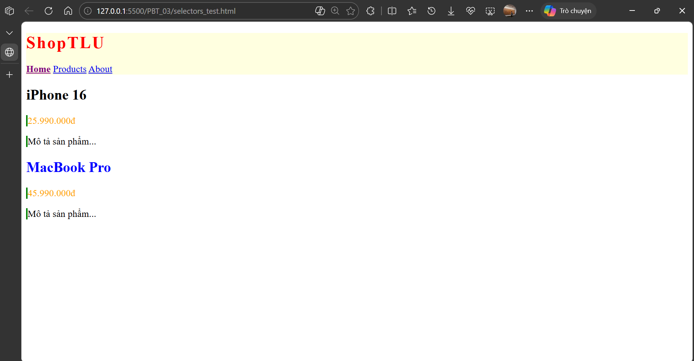

# PHẦN A - KIỂM TRA ĐỌC HIỂU

## Câu A1 - 3 Cách nhúng CSS

**Nguồn tham chiếu:**

- `08_introduction_css.md` — mục 3. Core Technical Truth > 3 cách thêm CSS

### 1. Inline CSS

```html
<h1 style="color: #2563eb; font-size: 32px;">Tiêu đề</h1>
```

**Ưu điểm:** Áp dụng ngay, không cần file CSS riêng, dễ test nhanh.

**Nhược điểm:** Không tái sử dụng được, khó maintain, không cache được, code HTML lộn xộn.

**Khi nào dùng:** Chỉ dùng khi cần override tạm thời hoặc xử lý khẩn cấp 1 chỗ, không dùng cho dự án thật.

---

### 2. Internal CSS

```html
<head>
  <style>
    h1 {
      color: #2563eb;
      font-size: 32px;
    }
  </style>
</head>
```

**Ưu điểm:** Không cần file riêng, phù hợp trang đơn lẻ, dễ thấy CSS và HTML cùng lúc.

**Nhược điểm:** Không dùng lại được cho nhiều trang, trang nào cũng phải viết lại CSS, không cache được.

**Khi nào dùng:** Dùng khi làm prototype hoặc trang chỉ có 1 file HTML duy nhất, không cần dùng chung CSS với trang khác.

---

### 3. External CSS

```html
<!-- trong file HTML -->
<head>
  <link rel="stylesheet" href="styles.css" />
</head>
```

```css
/* trong file styles.css */
h1 {
  color: #2563eb;
  font-size: 32px;
}
```

**Ưu điểm:** Tái sử dụng được cho nhiều trang, browser cache file CSS → load nhanh hơn từ trang thứ 2, dễ bảo trì, tách HTML và CSS rõ ràng.

**Nhược điểm:** Phải tạo thêm file riêng, nếu file CSS load lỗi thì trang mất toàn bộ style.

**Khi nào dùng:** Mọi dự án thật, từ trang nhỏ đến lớn đều nên dùng.

---

### Câu hỏi thêm: Nếu cả 3 cùng áp dụng lên 1 element, cái nào thắng?

**Inline CSS thắng** vì nó có specificity cao nhất (1000) so với internal và external (specificity phụ thuộc vào selector). Browser tính ưu tiên theo thứ tự: inline style > internal/external (cùng specificity thì xét thứ tự viết sau). Lý do là inline CSS viết trực tiếp trong attribute `style` của element nên gần nhất với element đó, browser ưu tiên nó hơn.

---

## Câu A2 - CSS Selectors — Dự đoán kết quả

**Nguồn tham chiếu:**

- `09_css_selectors.md` — mục 3. Core Technical Truth > 5 loại Selector cơ bản
- `09_css_selectors.md` — mục 3. Core Technical Truth > Combinator Selectors
- `09_css_selectors.md` — mục 3. Core Technical Truth > Pseudo-classes

```
1. h1                      → Chọn: "ShopTLU" (h1 duy nhất trong trang)
2. .price                  → Chọn: "25.990.000đ" và "45.990.000đ" (2 element có class price)
3. #app header             → Chọn: thẻ <header class="top-bar dark"> (header con cháu của #app)
4. nav a:first-child       → Chọn: "Home" (thẻ a đầu tiên trong nav)
5. .product.featured h2    → Chọn: "MacBook Pro" (h2 trong article vừa có class product vừa có featured)
6. article > p             → Chọn: tất cả p là con TRỰC TIẾP của article: "25.990.000đ", "Mô tả sản phẩm...", "45.990.000đ", "Mô tả sản phẩm..." (4 thẻ p)
7. a[href="/"]             → Chọn: "Home" (link có href chính xác bằng "/")
8. .top-bar.dark h1        → Chọn: "ShopTLU" (h1 trong element vừa có class top-bar vừa có class dark)
```



---

## Câu A3 - Box Model — Tính toán kích thước

**Nguồn tham chiếu:**

- `11_box_model.md` — mục 3. Core Technical Truth > `content-box` (mặc định)
- `11_box_model.md` — mục 3. Core Technical Truth > `border-box`
- `11_box_model.md` — mục 3. Core Technical Truth > Margin Collapse

### Trường hợp 1: content-box (mặc định)

```css
.box-1 {
  width: 400px;
  padding: 20px;
  border: 5px solid black;
  margin: 10px;
}
```

Với `content-box`, `width` chỉ tính phần content, padding và border cộng thêm ra ngoài:

→ **Chiều rộng hiển thị** = 400 + (20×2) + (5×2) = 400 + 40 + 10 = **450px**

→ **Không gian chiếm trên trang** = 450 + (10×2) = **470px** (cộng thêm margin 2 bên)

---

### Trường hợp 2: border-box

```css
.box-2 {
  box-sizing: border-box;
  width: 400px;
  padding: 20px;
  border: 5px solid black;
  margin: 10px;
}
```

Với `border-box`, `width: 400px` đã bao gồm cả padding và border, chúng co vào bên trong:

→ **Chiều rộng hiển thị** = **400px** (đúng như đặt, không bị phình ra)

→ **Kích thước content thực tế** = 400 - (20×2) - (5×2) = 400 - 40 - 10 = **350px**

→ **Không gian chiếm trên trang** = 400 + (10×2) = **420px** (cộng margin)

---

### Trường hợp 3: Margin collapse

```css
.box-a {
  margin-bottom: 25px;
}
.box-b {
  margin-top: 40px;
}
```

→ **Khoảng cách giữa box-a và box-b = 40px**

→ **Tại sao KHÔNG PHẢI 65px:** Đây là hiện tượng "Margin Collapse" — khi 2 block element xếp dọc nhau, margin của chúng không cộng lại mà gộp thành 1, lấy giá trị lớn hơn. 40 > 25 nên khoảng cách chỉ là 40px. Nếu 2 margin bằng nhau thì chỉ tính 1 lần.

---

### Nâng cao: margin-bottom: -10px và margin-top: 40px

Khoảng cách = **30px**

Khi có margin âm kết hợp margin dương thì tính: giá trị dương lớn nhất + giá trị âm nhỏ nhất = 40 + (-10) = 30px. Margin âm "kéo" 2 element lại gần nhau.

---

## Câu A4 - Specificity (Độ ưu tiên)

**Nguồn tham chiếu:**

- `09_css_selectors.md` — mục 3. Core Technical Truth > Specificity
- `10_inheritance_cascading.md` — mục 3. Core Technical Truth > Cascade

### 1. Tính specificity score (a, b, c)

| Rule   | Selector      | Specificity (a,b,c) | Giải thích       |
| ------ | ------------- | ------------------- | ---------------- |
| Rule A | `p`           | (0,0,1)             | 1 tag selector   |
| Rule B | `.price`      | (0,1,0)             | 1 class selector |
| Rule C | `#main-price` | (1,0,0)             | 1 ID selector    |
| Rule D | `p.price`     | (0,1,1)             | 1 class + 1 tag  |

### 2. Element sẽ có màu gì?

**Màu đỏ (red)** — Rule C `#main-price` thắng vì có specificity cao nhất (1,0,0). ID selector luôn thắng class và tag selector.

Thứ tự từ thấp đến cao: A (0,0,1) < B (0,1,0) < D (0,1,1) < C (1,0,0)

### 3. Nếu thêm inline style `style="color: orange"`?

Element sẽ có **màu cam (orange)** vì inline style có độ ưu tiên cao hơn tất cả selector bên ngoài kể cả ID selector.

### 4. Nếu Rule A thêm `!important`?

Element sẽ có **màu đen (black)** vì `!important` ghi đè tất cả mọi thứ kể cả ID selector và inline style (trừ khi inline style cũng có `!important`). Dù Rule A có specificity thấp nhất (0,0,1) nhưng `!important` đưa nó lên ưu tiên tối cao.

---
