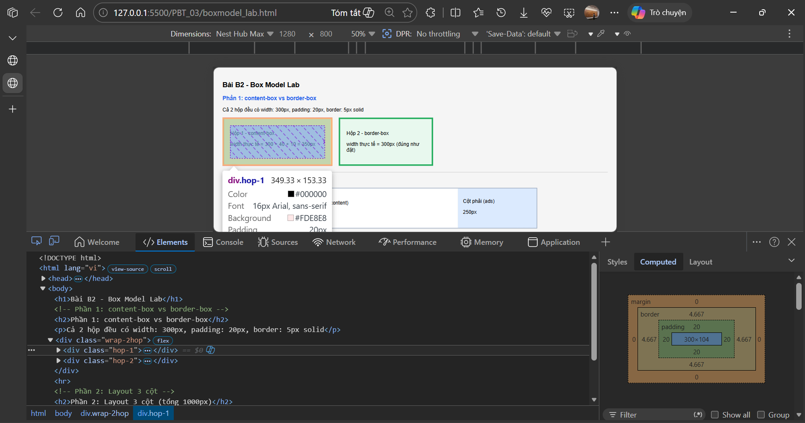
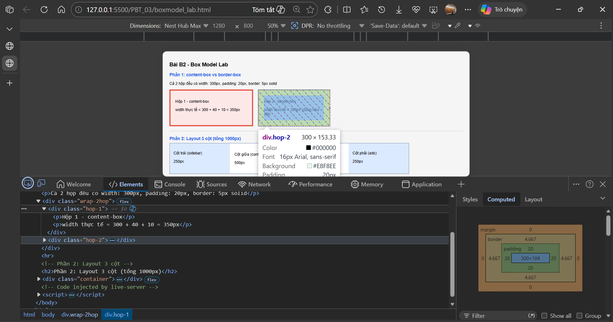
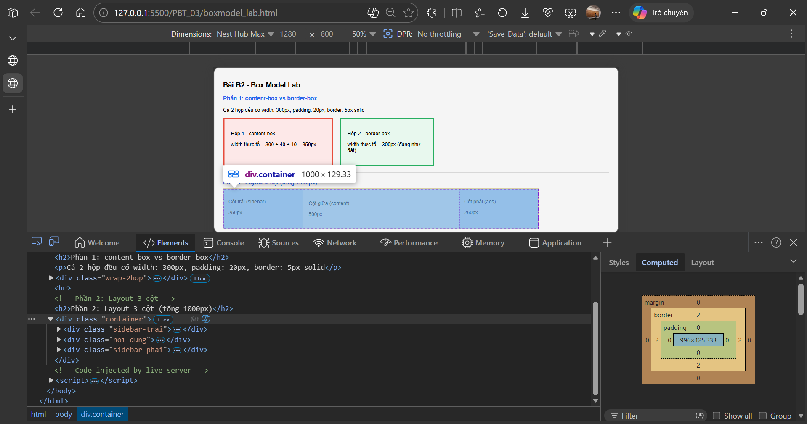
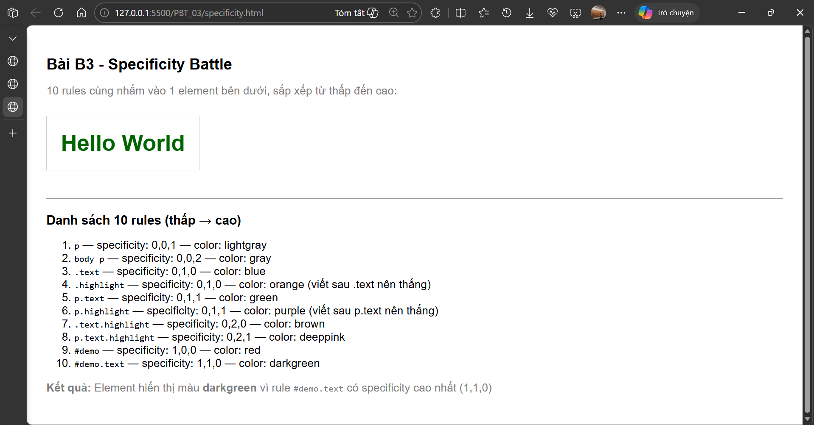
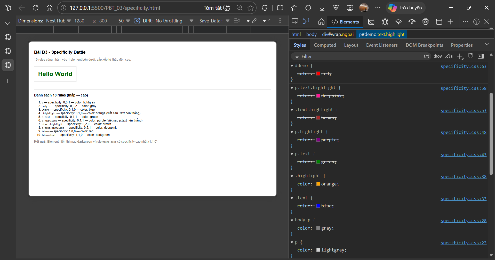
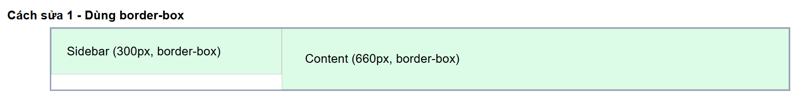
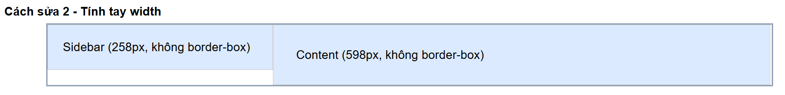
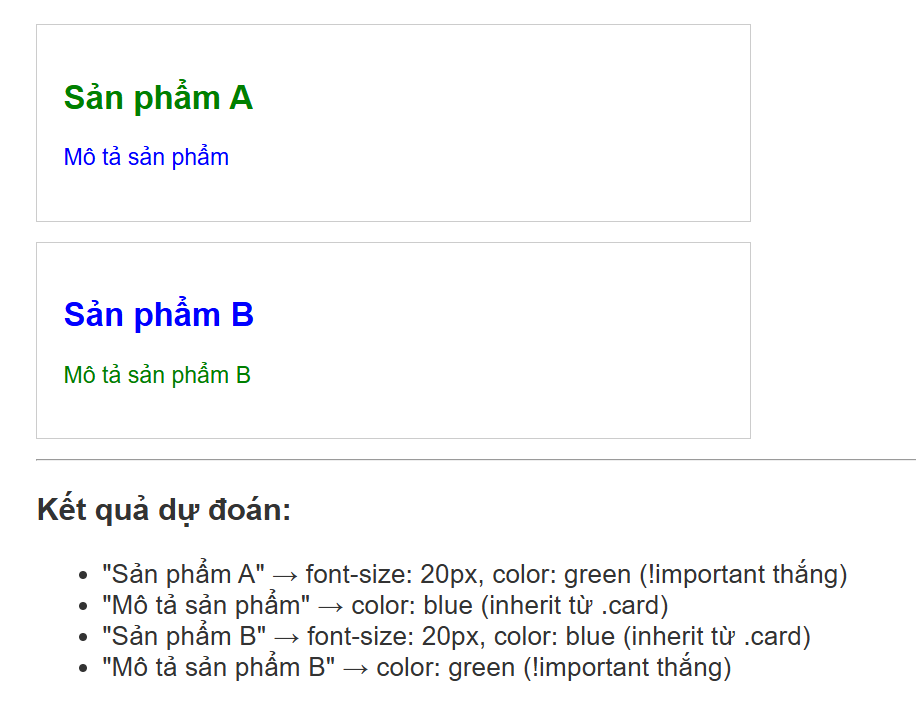

# PHẦN A - KIỂM TRA ĐỌC HIỂU

## Câu A1 - 3 Cách nhúng CSS

**Nguồn tham chiếu:**

- `08_introduction_css.md` — mục 3. Core Technical Truth > 3 cách thêm CSS

### 1. Inline CSS

```html
<h1 style="color: #2563eb; font-size: 32px;">Tiêu đề</h1>
```

**Ưu điểm:** Áp dụng ngay, không cần file CSS riêng, dễ test nhanh.

**Nhược điểm:** Không tái sử dụng được, khó maintain, không cache được, code HTML lộn xộn.

**Khi nào dùng:** Chỉ dùng khi cần override tạm thời hoặc xử lý khẩn cấp 1 chỗ, không dùng cho dự án thật.

---

### 2. Internal CSS

```html
<head>
  <style>
    h1 {
      color: #2563eb;
      font-size: 32px;
    }
  </style>
</head>
```

**Ưu điểm:** Không cần file riêng, phù hợp trang đơn lẻ, dễ thấy CSS và HTML cùng lúc.

**Nhược điểm:** Không dùng lại được cho nhiều trang, trang nào cũng phải viết lại CSS, không cache được.

**Khi nào dùng:** Dùng khi làm prototype hoặc trang chỉ có 1 file HTML duy nhất, không cần dùng chung CSS với trang khác.

---

### 3. External CSS

```html
<!-- trong file HTML -->
<head>
  <link rel="stylesheet" href="styles.css" />
</head>
```

```css
/* trong file styles.css */
h1 {
  color: #2563eb;
  font-size: 32px;
}
```

**Ưu điểm:** Tái sử dụng được cho nhiều trang, browser cache file CSS → load nhanh hơn từ trang thứ 2, dễ bảo trì, tách HTML và CSS rõ ràng.

**Nhược điểm:** Phải tạo thêm file riêng, nếu file CSS load lỗi thì trang mất toàn bộ style.

**Khi nào dùng:** Mọi dự án thật, từ trang nhỏ đến lớn đều nên dùng.

---

### Câu hỏi thêm: Nếu cả 3 cùng áp dụng lên 1 element, cái nào thắng?

**Inline CSS thắng** vì nó có specificity cao nhất (1000) so với internal và external (specificity phụ thuộc vào selector). Browser tính ưu tiên theo thứ tự: inline style > internal/external (cùng specificity thì xét thứ tự viết sau). Lý do là inline CSS viết trực tiếp trong attribute `style` của element nên gần nhất với element đó, browser ưu tiên nó hơn.

---

## Câu A2 - CSS Selectors — Dự đoán kết quả

**Nguồn tham chiếu:**

- `09_css_selectors.md` — mục 3. Core Technical Truth > 5 loại Selector cơ bản
- `09_css_selectors.md` — mục 3. Core Technical Truth > Combinator Selectors
- `09_css_selectors.md` — mục 3. Core Technical Truth > Pseudo-classes

```
1. h1                      → Chọn: "ShopTLU" (h1 duy nhất trong trang)
2. .price                  → Chọn: "25.990.000đ" và "45.990.000đ" (2 element có class price)
3. #app header             → Chọn: thẻ <header class="top-bar dark"> (header con cháu của #app)
4. nav a:first-child       → Chọn: "Home" (thẻ a đầu tiên trong nav)
5. .product.featured h2    → Chọn: "MacBook Pro" (h2 trong article vừa có class product vừa có featured)
6. article > p             → Chọn: tất cả p là con TRỰC TIẾP của article: "25.990.000đ", "Mô tả sản phẩm...", "45.990.000đ", "Mô tả sản phẩm..." (4 thẻ p)
7. a[href="/"]             → Chọn: "Home" (link có href chính xác bằng "/")
8. .top-bar.dark h1        → Chọn: "ShopTLU" (h1 trong element vừa có class top-bar vừa có class dark)
```


---

## Câu A3 - Box Model — Tính toán kích thước

**Nguồn tham chiếu:**

- `11_box_model.md` — mục 3. Core Technical Truth > `content-box` (mặc định)
- `11_box_model.md` — mục 3. Core Technical Truth > `border-box`
- `11_box_model.md` — mục 3. Core Technical Truth > Margin Collapse

### Trường hợp 1: content-box (mặc định)

```css
.box-1 {
  width: 400px;
  padding: 20px;
  border: 5px solid black;
  margin: 10px;
}
```

Với `content-box`, `width` chỉ tính phần content, padding và border cộng thêm ra ngoài:

→ **Chiều rộng hiển thị** = 400 + (20×2) + (5×2) = 400 + 40 + 10 = **450px**

→ **Không gian chiếm trên trang** = 450 + (10×2) = **470px** (cộng thêm margin 2 bên)

---

### Trường hợp 2: border-box

```css
.box-2 {
  box-sizing: border-box;
  width: 400px;
  padding: 20px;
  border: 5px solid black;
  margin: 10px;
}
```

Với `border-box`, `width: 400px` đã bao gồm cả padding và border, chúng co vào bên trong:

→ **Chiều rộng hiển thị** = **400px** (đúng như đặt, không bị phình ra)

→ **Kích thước content thực tế** = 400 - (20×2) - (5×2) = 400 - 40 - 10 = **350px**

→ **Không gian chiếm trên trang** = 400 + (10×2) = **420px** (cộng margin)

---

### Trường hợp 3: Margin collapse

```css
.box-a {
  margin-bottom: 25px;
}
.box-b {
  margin-top: 40px;
}
```

→ **Khoảng cách giữa box-a và box-b = 40px**

→ **Tại sao KHÔNG PHẢI 65px:** Đây là hiện tượng "Margin Collapse" — khi 2 block element xếp dọc nhau, margin của chúng không cộng lại mà gộp thành 1, lấy giá trị lớn hơn. 40 > 25 nên khoảng cách chỉ là 40px. Nếu 2 margin bằng nhau thì chỉ tính 1 lần.

---

### Nâng cao: margin-bottom: -10px và margin-top: 40px

Khoảng cách = **30px**

Khi có margin âm kết hợp margin dương thì tính: giá trị dương lớn nhất + giá trị âm nhỏ nhất = 40 + (-10) = 30px. Margin âm "kéo" 2 element lại gần nhau.

---

## Câu A4 - Specificity (Độ ưu tiên)

**Nguồn tham chiếu:**

- `09_css_selectors.md` — mục 3. Core Technical Truth > Specificity
- `10_inheritance_cascading.md` — mục 3. Core Technical Truth > Cascade

### 1. Tính specificity score (a, b, c)

| Rule   | Selector      | Specificity (a,b,c) | Giải thích       |
| ------ | ------------- | ------------------- | ---------------- |
| Rule A | `p`           | (0,0,1)             | 1 tag selector   |
| Rule B | `.price`      | (0,1,0)             | 1 class selector |
| Rule C | `#main-price` | (1,0,0)             | 1 ID selector    |
| Rule D | `p.price`     | (0,1,1)             | 1 class + 1 tag  |

### 2. Element sẽ có màu gì?

**Màu đỏ (red)** — Rule C `#main-price` thắng vì có specificity cao nhất (1,0,0). ID selector luôn thắng class và tag selector.

Thứ tự từ thấp đến cao: A (0,0,1) < B (0,1,0) < D (0,1,1) < C (1,0,0)

### 3. Nếu thêm inline style `style="color: orange"`?

Element sẽ có **màu cam (orange)** vì inline style có độ ưu tiên cao hơn tất cả selector bên ngoài kể cả ID selector.

### 4. Nếu Rule A thêm `!important`?

Element sẽ có **màu đen (black)** vì `!important` ghi đè tất cả mọi thứ kể cả ID selector và inline style (trừ khi inline style cũng có `!important`). Dù Rule A có specificity thấp nhất (0,0,1) nhưng `!important` đưa nó lên ưu tiên tối cao.

---

---

# PHẦN B - THỰC HÀNH CODE

## Bài B1 - Style trang Profile

**Nguồn tham chiếu:**

- `09_css_selectors.md` — mục 3. Core Technical Truth > 5 loại Selector cơ bản
- `09_css_selectors.md` — mục 3. Core Technical Truth > Pseudo-classes

### Danh sách 5 loại selector đã dùng trong file `style.css`

| Loại selector         | Ví dụ trong file                            | Dùng để làm gì                                     |
| --------------------- | ------------------------------------------- | -------------------------------------------------- |
| Element selector      | `body`, `table`, `footer`                   | Set style mặc định cho toàn trang                  |
| Class selector        | `.active`                                   | Style link đang được chọn trong nav                |
| ID selector           | `#about`, `#skills`, `#contact`             | Style từng section riêng biệt                      |
| Descendant selector   | `nav a`, `thead tr`, `tbody tr`             | Chọn link bên trong nav, row bên trong thead/tbody |
| Pseudo-class selector | `a:hover`, `tr:nth-child(even)`, `tr:hover` | Style khi hover, zebra striping cho bảng           |


---

## Bài B2 - Box Model Lab

**Nguồn tham chiếu:**

- `11_box_model.md` — mục 3. Core Technical Truth > `content-box` (mặc định)
- `11_box_model.md` — mục 3. Core Technical Truth > `border-box`

### Phần 1 — content-box vs border-box

Cả 2 hộp đều đặt `width: 300px`, `padding: 20px`, `border: 5px solid`.

```
Hộp 1 (content-box): chiều rộng thực tế = 350px (đo từ DevTools)
Hộp 2 (border-box):  chiều rộng thực tế = 300px (đo từ DevTools)
```

**Giải thích sự khác biệt:**

Hộp 1 dùng `content-box` (mặc định) nên `width: 300px` chỉ tính phần content, padding và border bị cộng thêm ra ngoài: 300 + (20×2) + (5×2) = 350px. Hộp 2 dùng `border-box` nên `width: 300px` đã bao gồm luôn padding và border, chúng co vào trong, tổng vẫn đúng 300px.




---

### Phần 2 — Layout 3 cột

3 cột trong container 1000px: cột trái 250px, cột giữa 500px, cột phải 250px. Tổng = 250 + 500 + 250 = 1000px đúng khít.

Dùng `box-sizing: border-box` cho toàn trang (dòng `* { box-sizing: border-box }`) nên padding của mỗi cột co vào trong, không làm tổng vượt quá 1000px.

Nếu không dùng `border-box`: cột trái thực tế = 250 + 30 = 280px, cột giữa = 500 + 40 = 540px, cột phải = 250 + 30 = 280px → tổng = 1100px → vỡ layout.



---

## Bài B3 - Specificity Battle

**Nguồn tham chiếu:**

- `09_css_selectors.md` — mục 3. Core Technical Truth > Specificity
- `10_inheritance_cascading.md` — mục 3. Core Technical Truth > Cascade

### 1. Danh sách 10 rules + specificity score

Element target: `<p id="demo" class="text highlight">Hello World</p>`

| STT | Rule               | Specificity (a,b,c) | Color đặt |
| --- | ------------------ | ------------------- | --------- |
| 1   | `p`                | (0,0,1)             | lightgray |
| 2   | `body p`           | (0,0,2)             | gray      |
| 3   | `.text`            | (0,1,0)             | blue      |
| 4   | `.highlight`       | (0,1,0)             | orange    |
| 5   | `p.text`           | (0,1,1)             | green     |
| 6   | `p.highlight`      | (0,1,1)             | purple    |
| 7   | `.text.highlight`  | (0,2,0)             | brown     |
| 8   | `p.text.highlight` | (0,2,1)             | deeppink  |
| 9   | `#demo`            | (1,0,0)             | red       |
| 10  | `#demo.text`       | (1,1,0)             | darkgreen |

### 2. Element hiển thị màu gì? Tại sao?

Element hiển thị màu **darkgreen** vì rule `#demo.text` có specificity cao nhất là (1,1,0) — gồm 1 ID selector và 1 class selector. Không có rule nào có specificity cao hơn nên nó thắng.



### 3. Thay đổi thứ tự rules trong CSS file, kết quả có đổi không?

**Phần lớn là không đổi** — vì specificity khác nhau thì thứ tự không quan trọng, rule có specificity cao hơn luôn thắng dù viết trước hay sau.

**Trường hợp ngoại lệ:** Nếu đổi thứ tự của 2 rule có **cùng specificity** thì kết quả sẽ đổi. Ví dụ rule 3 `.text` và rule 4 `.highlight` đều có specificity (0,1,0) — nếu đổi thứ tự 2 rule này thì `.text` sẽ thắng thay vì `.highlight` vì rule viết sau mới thắng khi bằng điểm.



---

# PHẦN C - DEBUG & SUY LUẬN

## Câu C1 - Debug CSS Layout

**Nguồn tham chiếu:**

- `11_box_model.md` — mục 3. Core Technical Truth > `content-box` (mặc định)
- `11_box_model.md` — mục 3. Core Technical Truth > `border-box`

### 1. Tính chiều rộng thực tế của sidebar và content

Cả 2 đều dùng `content-box` mặc định, nên padding và border cộng thêm ra ngoài `width`:

**Sidebar:**

- width: 300px + padding: 20px×2 + border: 1px×2
- = 300 + 40 + 2 = **342px**

**Content:**

- width: 660px + padding: 30px×2 + border: 1px×2
- = 660 + 60 + 2 = **722px**

### 2. Tại sao layout bị vỡ?

Tổng chiều rộng thực tế = 342 + 722 = **1064px** nhưng container chỉ có **960px**. Tổng vượt quá 104px nên `.content` bị đẩy xuống dòng mới, không còn chỗ để float bên cạnh `.sidebar` nữa.

### 3. Hai cách sửa

**Cách 1: Dùng `box-sizing: border-box`**

Thêm `box-sizing: border-box` cho cả 2 element, giữ nguyên `width` 300px và 660px. Khi đó padding và border sẽ co vào trong, tổng 300 + 660 = 960px vừa khít container.

```css
.sidebar {
  box-sizing: border-box;
  width: 300px;
  padding: 20px;
  border: 1px solid #ccc;
  float: left;
}
.content {
  box-sizing: border-box;
  width: 660px;
  padding: 30px;
  border: 1px solid #ccc;
  float: left;
}
```

**Cách 2: Không dùng border-box, giảm width để bù phần padding + border**

Tính lại width bằng cách trừ đi phần padding và border:

- Sidebar thực cần 300px → width phải đặt = 300 - 40 - 2 = **258px**
- Content thực cần 660px → width phải đặt = 660 - 60 - 2 = **598px**
- Tổng kiểm tra: 258 + 40 + 2 + 598 + 60 + 2 = 960px ✅

```css
.sidebar {
  width: 258px;
  padding: 20px;
  border: 1px solid #ccc;
  float: left;
}
.content {
  width: 598px;
  padding: 30px;
  border: 1px solid #ccc;
  float: left;
}
```

### 4. File kiểm chứng

Tạo file `debug_layout.html` + `debug_layout.css` với 2 section riêng để chứng minh cả 2 cách sửa đều hoạt động.




---

## Câu C2 - Cascade Puzzle

**Nguồn tham chiếu:**

- `10_inheritance_cascading.md` — mục 3. Core Technical Truth > Cascade
- `10_inheritance_cascading.md` — mục 3. Core Technical Truth > Inheritance

### Phân tích HTML và CSS

Trước khi trả lời, liệt kê các rule liên quan:

```css
body {
  font-size: 16px;
  color: #333;
}
.container {
  font-size: 14px;
}
.card {
  color: blue;
}
.card .title {
  font-size: 20px;
}
.card p {
  color: inherit;
}
#featured .title {
  color: red;
}
.highlight {
  color: green !important;
}
```

---

### 1. "Sản phẩm A" (h2.title.highlight trong #featured.card) có font-size = ? và color = ?

**font-size = 20px**

Rule `.card .title { font-size: 20px }` áp dụng trực tiếp → 20px. (Không kế thừa từ `.container: 14px` vì có rule trực tiếp hơn)

**color = green**

Có 2 rule nhắm vào element này:

- `#featured .title { color: red }` — specificity (1,1,0)
- `.highlight { color: green !important }` — có `!important`

Dù `#featured .title` có specificity cao hơn, nhưng `.highlight` có `!important` nên thắng tất cả. **Màu = green**

---

### 2. "Mô tả sản phẩm" (p trong #featured.card) có color = ?

Rule `.card p { color: inherit }` áp dụng → `inherit` tức là kế thừa màu từ element cha.

Cha trực tiếp là `.card#featured` có `color: blue` (từ rule `.card { color: blue }`). Không có rule nào override màu của `.card` này.

→ `inherit` → kế thừa `blue` từ `.card`

**color = blue**

---

### 3. "Sản phẩm B" (h2.title trong .card thứ 2, không có id featured) có font-size = ? và color = ?

**font-size = 20px**

Rule `.card .title { font-size: 20px }` vẫn áp dụng → 20px

**color = blue**

Các rule nhắm vào element này:

- `#featured .title { color: red }` — KHÔNG áp dụng vì h2 này không trong `#featured`
- `.highlight` — KHÔNG áp dụng vì h2 này không có class highlight
- `.card .title { font-size: 20px }` — chỉ set font-size, không set color
- Vậy color được kế thừa từ `.card` → `.card { color: blue }` → **blue**

---

### 4. "Mô tả sản phẩm B" (p.highlight trong .card thứ 2) có color = ?

Có 2 rule áp dụng:

- `.card p { color: inherit }` — specificity (0,1,1)
- `.highlight { color: green !important }` — có `!important`

`.highlight` với `!important` thắng mọi thứ.

**color = green**

---

### Tổng kết bảng kết quả

| Element                              | font-size                    | color | Lý do                                            |
| ------------------------------------ | ---------------------------- | ----- | ------------------------------------------------ |
| "Sản phẩm A" (h2 trong #featured)    | 20px                         | green | `.highlight !important` thắng `#featured .title` |
| "Mô tả sản phẩm" (p trong #featured) | 14px (inherit từ .container) | blue  | `inherit` → lấy màu của .card                    |
| "Sản phẩm B" (h2 trong .card thứ 2)  | 20px                         | blue  | inherit từ .card, không có rule màu trực tiếp    |
| "Mô tả sản phẩm B" (p.highlight)     | 14px (inherit từ .container) | green | `.highlight !important` thắng tất cả             |


